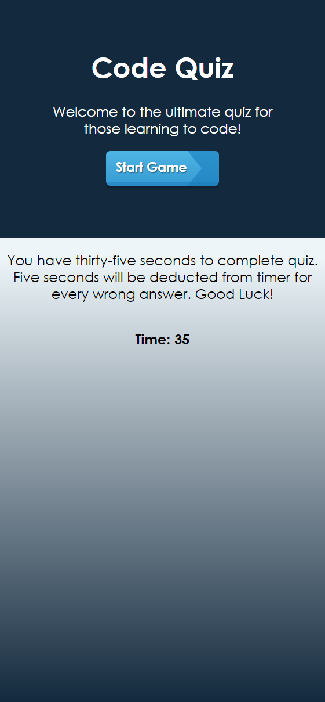
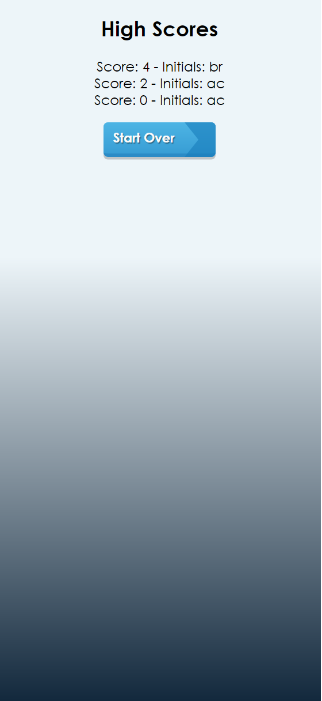

Code Quiz - UNC Coding Academy HW 4

This application is a timed quiz with four questions pertaining to coding. 

The start page includes the rules of the game, which is that there are 35 seconds to complete the quiz with 5 seconds removed from the timer when an incorrect answer is chosen. The game is over when the time runs out or the user answers the last question. 

The quiz starts when the user clicks the start game button. The quiz uses alerts to let the user know if the question they answered was answered correctly or not. 

When the user is done with the quiz a prompt appears for the user to input their initials. The initials will be stored along with the score and create a high scores list that is sorted by high score to low. If the user does not input anything or they hit cancel, the user will be prompted two more times before the score will not be stored. 

The user can then click the start over button to relaunch the start page. 

[Application hosted on GitHub](https://likearollinson.github.io/code-quiz/)

